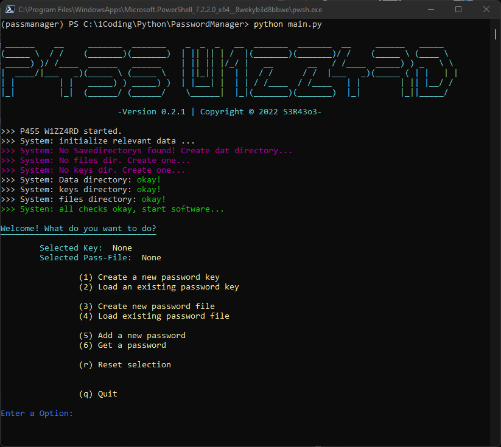

# P455 W1ZZ4RD #
>
> P455 W1ZZ4RD is a commandline passwordmanager.
>
> The software will create and save passwordhashes in a secure way.
> To get started read the [install](#Installation) section.
>  
> Software just tested and runned on a Windows 11 system!
>
> - 
> - 
>

## Installation ##

Python version 3.7+ required!

> - download the source code from [here](https://github.com/sera619/PasswordManager/archive/refs/heads/master.zip)
> - Open a Terminal in the rootdirectory and type in:
>
>```bash
>pip3 install -r requirements.txt
>```
>
>to install all dependencies. After that u can simple run:
>
>```bash
>python main.py
>```
>
> - Follow the given instructions on the Terminal!
> - You can Watch this youtube-video for example (click on image):
>
>    [](https://www.youtube.com/watch?v=iTgesNe3-3s)
>
> ### Need Help ? ###
>
> - If you facing bugs or have some other trouble please open a new [issue](https://github.com/sera619/PasswordManager/issues).
>

## Code of Conduct ##

> If u want to contribute just do a pull request with a shorthand note of your edits
